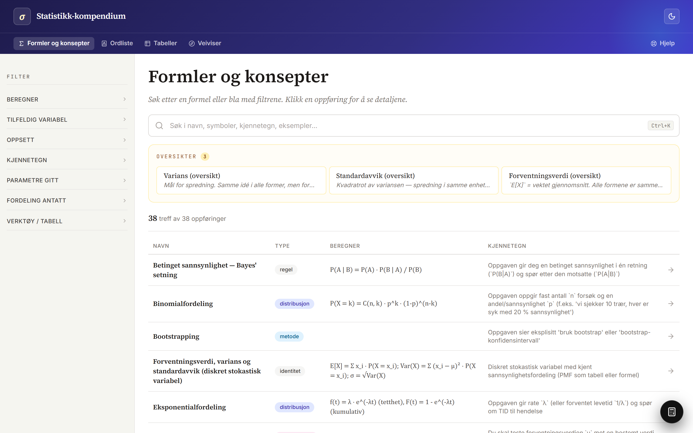
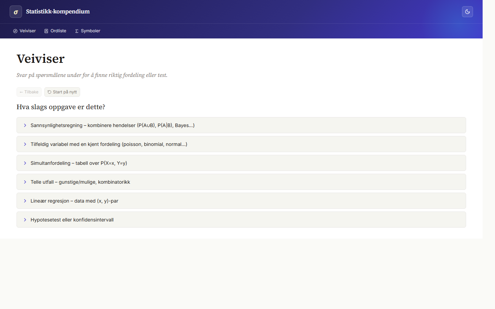
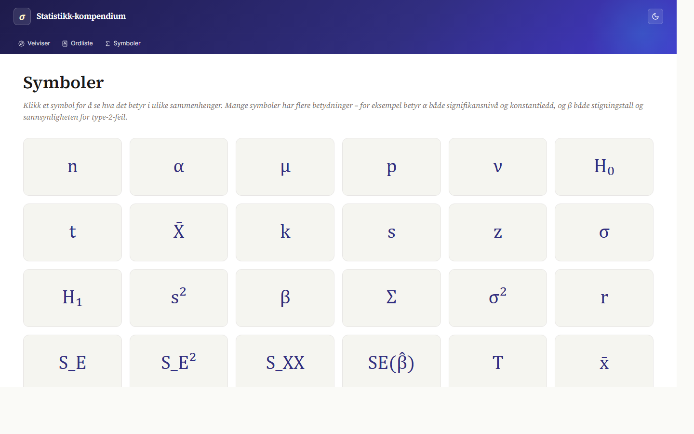
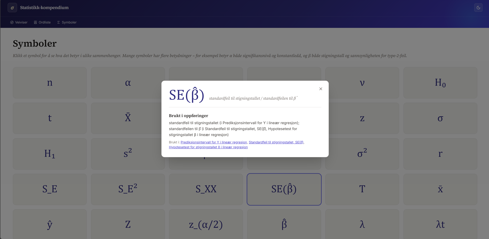
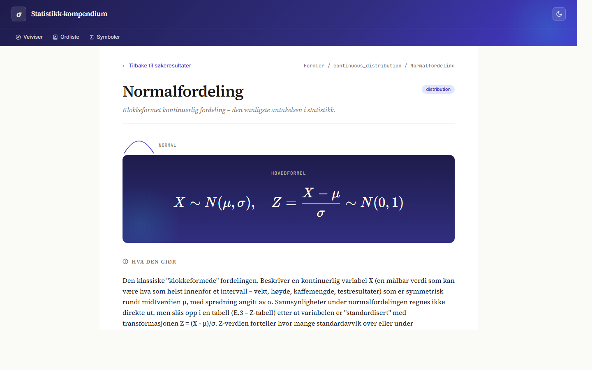
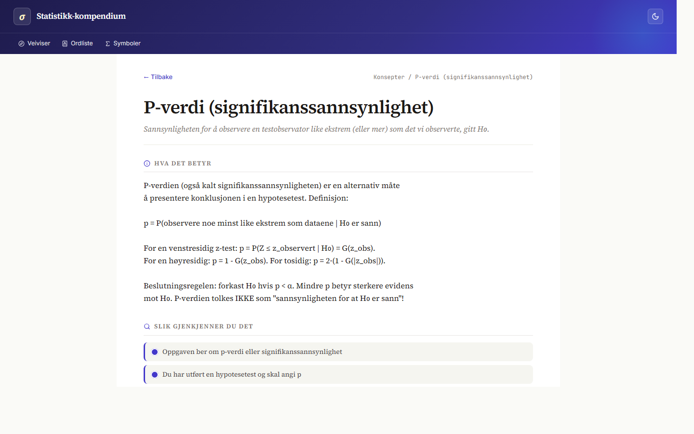
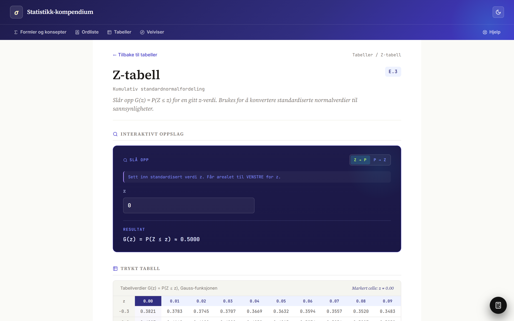
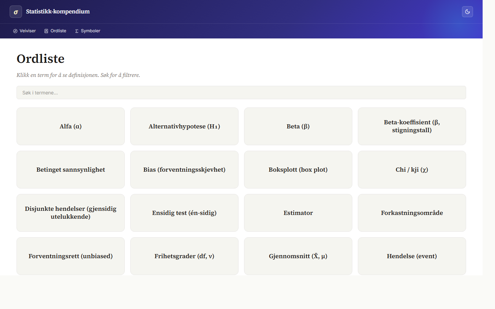

<div align="center">

# Statistikk-kompendium

</div>

**A tool that helps anyone, regardless of prior knowledge, identify which formula to use and how to apply it.** This is achieved in three primary ways:

- **Filter.** Narrow the catalog by characteristics observable in the problem.
- **Guide (*Veiviser*).** A dynamic survey that asks questions to identify the right formula or concept, then recommends the most likely match.
- **Step-by-step pages.** Every formula and concept page walks through how to apply it.

<p align="center">
  
</p>

---

## What's inside

|        |                                                       |
|-------:|-------------------------------------------------------|
| **34** | formulas: distributions, tests, intervals             |
| **17** | concepts: kovarians, p-verdi, Poisson-prosess, ...    |
|  **6** | tables: E.1 through E.6 with interactive lookup       |
| **28** | symbols, each linked to where they appear             |
| **60** | glossary terms in Norwegian                           |

## Screenshots

<table>
<tr>
<td width="50%"><br><sub><b>Wizard</b> that helps you pick the right test or distribution.</sub></td>
<td width="50%"><br><sub><b>Wizard recommendation</b> after answering the survey questions.</sub></td>
</tr>
<tr>
<td><br><sub><b>Symbols</b> grid, disambiguating overloaded glyphs like &alpha; and &beta;.</sub></td>
<td><br><sub><b>Symbol detail</b> with definition and the entries it appears in.</sub></td>
</tr>
<tr>
<td><br><sub><b>Formula entry</b> with a KaTeX hero formula and cited sources.</sub></td>
<td><br><sub><b>Concept page</b> for cross-cutting ideas like p-verdi.</sub></td>
</tr>
<tr>
<td><br><sub><b>Interactive table</b> for E.1 through E.6, with live lookup.</sub></td>
<td><br><sub><b>Glossary</b> of Norwegian statistics terms.</sub></td>
</tr>
</table>

## Stack

React 18, TypeScript, Vite, Tailwind, KaTeX, Fuse.js, Zod. Content is one YAML file per entry, validated at build time so a malformed entry fails loudly.

## Layout

```
content/
  entries/      formulas, one YAML per file
  concepts/     cross-cutting ideas
  tables/       E.1 through E.6 lookup configs
  symbols/      symbol definitions
  glossary/     Norwegian terms
src/            React app
screenshots/    captured via capture.sh
```
