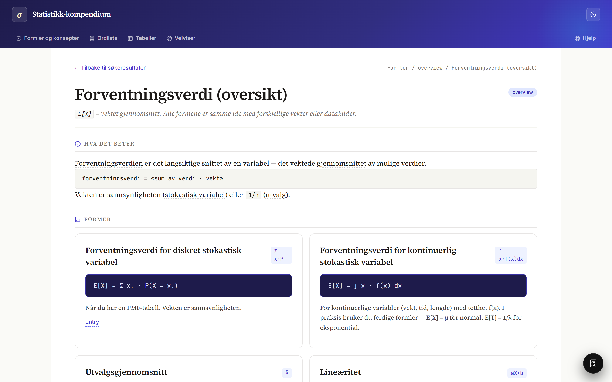
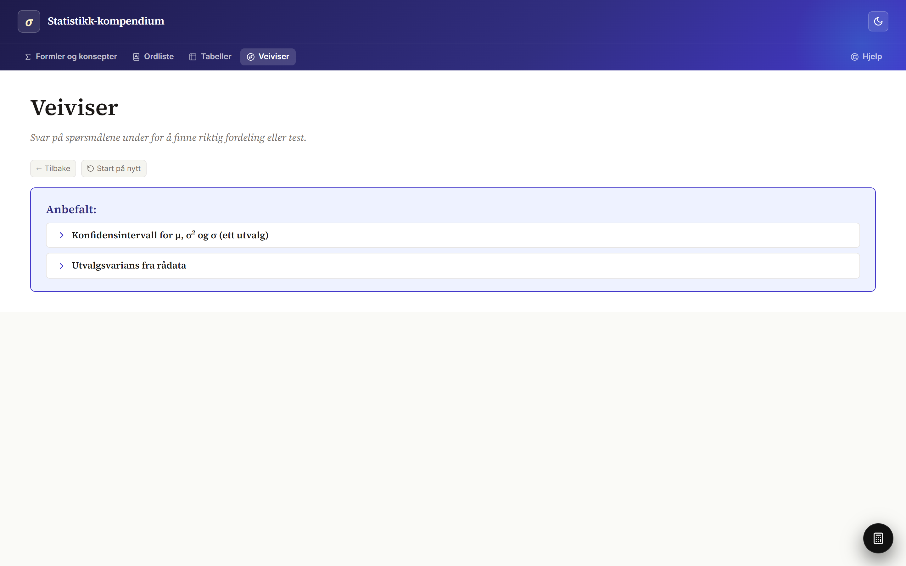

<div align="center">

# Statistikk-kompendium

</div>

<p align="center"><b>A tool that helps anyone, regardless of prior knowledge, identify which formula to use and how to apply it.</b><br><i>This is achieved in three primary ways:</i></p>

<table>
<tr>
<td width="33%" valign="top" align="center"><b>Filter</b><br><sub>Narrow the catalog by characteristics observable in the problem.</sub></td>
<td width="34%" valign="top" align="center"><b>Guide<i>(Veiviser)</i></b><br><sub>A dynamic survey that asks questions to identify the right formula or concept, then recommends the most likely match.</sub></td>
<td width="33%" valign="top" align="center"><b>Step-by-step pages</b><br><sub>Every formula and concept page walks through how to apply it.</sub></td>
</tr>
</table>

<p align="center">
  
</p>

---

## What's inside

|        |                                                       |
|-------:|-------------------------------------------------------|
| **38** | formulas and concepts: distributions, tests, intervals, overviews |
|  **8** | tables: E.1 through E.8 with interactive lookup       |
| **28** | symbols, each linked to where they appear             |

## Screenshots

<table>
<tr>
<td width="50%"><br><sub><b>Formula entry</b> with a KaTeX hero formula and cited sources.</sub></td>
<td width="50%"><br><sub><b>Overview entry</b> that gathers every form of a cross-cutting idea.</sub></td>
</tr>
<tr>
<td><br><sub><b>Wizard</b> that helps you pick the right test or distribution.</sub></td>
<td><br><sub><b>Wizard recommendation</b> after answering the survey questions.</sub></td>
</tr>
<tr>
<td><br><sub><b>Interactive table</b> for E.1 through E.8, with live lookup.</sub></td>
<td><br><sub><b>Help</b> with the floating calculator and a curated list of tricky exam tasks.</sub></td>
</tr>
</table>

## Stack

React 18, TypeScript, Vite, Tailwind, KaTeX, Fuse.js, Zod. Content is one YAML file per entry, validated at build time so a malformed entry fails loudly.

## Layout

```
content/
  entries/      formulas and concepts, one YAML per file
  tables/       E.1 through E.8 lookup configs
  symbols/      symbol definitions
src/            React app
screenshots/    captured via scripts/capture.mjs
```
